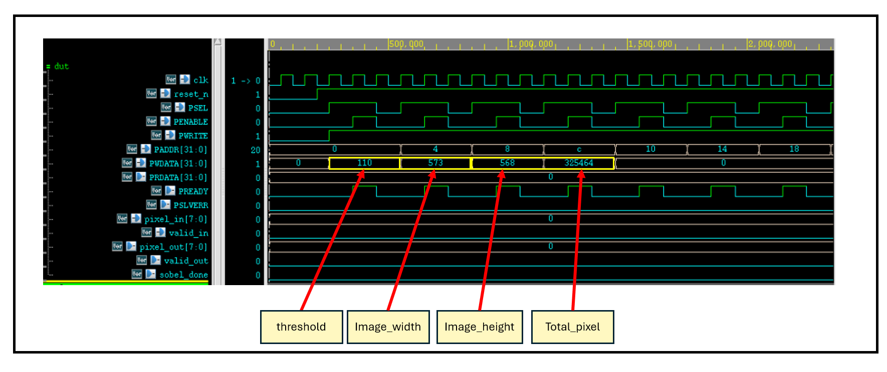
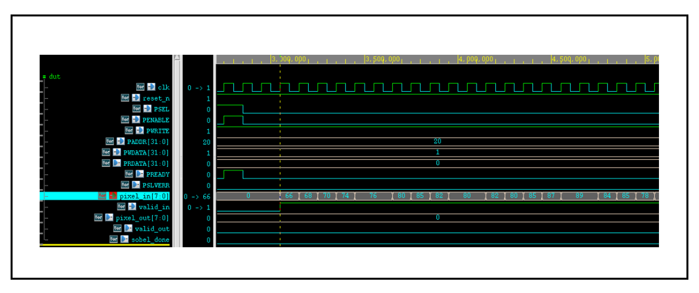
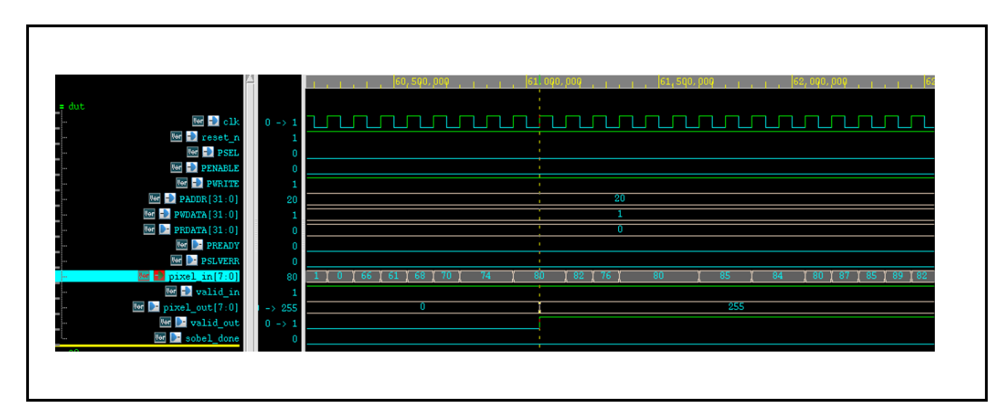
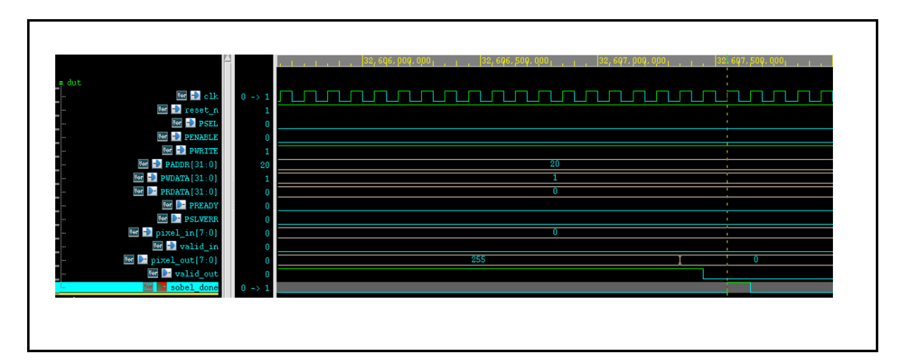

# Sobel Edge Detection Hardware (SystemVerilog)

This project implements a real-time, flexible edge detection accelerator in SystemVerilog. It performs 3×3 convolution using 4 configurable kernels (Sobel and diagonal by default) and applies a threshold to detect edges in streaming grayscale images. The design is optimized for FPGA/ASIC integration and is fully configurable via an AMBA APB interface.

---

##  Features

- 4 parallel 3×3 convolution kernels (default: Sobel X/Y + diagonals)
- Thresholding: output is 0 or gradient magnitude
- Streaming architecture with 1-pixel-per-cycle input
- Valid-in/valid-out handshake for input/output flow control
- Line buffer with SRAM for 3-row sliding window
- APB interface for runtime configuration of image size, threshold, and kernels
- Scalable and modular SystemVerilog design

---

##  Architecture Overview

The system consists of the following main modules:

- **Line Buffer**  
  Buffers 3 rows of pixels using SRAM. Generates a valid 3×3 sliding window as pixels stream in.

- **Convolution Calculator**  
  Applies 4 independent 3×3 kernels (default: Sobel X, Sobel Y, and two diagonals). Each kernel computes a gradient response for the current window. The maximum response is passed to the threshold block.

- **Threshold Block**  
  Compares the maximum of the 4 gradient responses to a programmable threshold. If the value is greater than or equal to the threshold, the output is the magnitude; otherwise, the output is 0.

- **Controller**  
  Coordinates valid signals, manages the sliding window generation, and synchronizes processing start and stop.

- **APB Register File**  
  Receives configuration from an external CPU or testbench using the AMBA APB protocol. Allows runtime control of image size, threshold value, and kernel weights.

---

##  Input/Output Interface

###  Streaming Data

- **Inputs**
  - `pixel_in [7:0]` — Grayscale input pixel (1 per clock cycle)
  - `valid_in` — High when `pixel_in` is valid

- **Outputs**
  - `gradient_out [7:0]` — Output gradient magnitude (or 0 if below threshold)
  - `valid_out` — High when `gradient_out` is valid

Once 3 full rows are buffered, `valid_out` follows `valid_in` with a short latency. Output values represent the strongest response from the 4 kernels (after thresholding).

---

### 🛠️ Control Interface (APB)

The module is configured via an **AMBA APB interface**, with the following programmable registers:

| Register         | Description                                                                 |
|------------------|-----------------------------------------------------------------------------|
| `image_width`    | Number of pixels per row                                                    |
| `image_height`   | Number of pixels per column                                                 |
| `total_pixels`   | Total number of pixels to process                                           |
| `threshold`      | Minimum gradient magnitude to keep as output                                |
| `kernel_0`       | 3×3 kernel (default: Sobel X if all elements = 0)                           |
| `kernel_1`       | 3×3 kernel (default: Sobel Y if all elements = 0)                           |
| `kernel_2`       | 3×3 kernel (default: Diagonal 1 if all elements = 0)                        |
| `kernel_3`       | 3×3 kernel (default: Diagonal 2 if all elements = 0)                        |
| `start`          | Start processing once all configs are loaded                                |

> ℹ️ **Note:** If a kernel is written with all-zero values, the corresponding **default kernel** will be used internally (see below).

---

##  Default Kernels

```text
Sobel X:        Sobel Y:        Diagonal 1:     Diagonal 2:
[-1  0  1]      [-1 -2 -1]      [-2 -1  0]      [ 0 -1 -2]
[-2  0  2]      [ 0  0  0]      [-1  0  1]      [ 1  0 -1]
[-1  0  1]      [ 1  2  1]      [ 0  1  2]      [ 2  1  0]
```


## 🧪 Testbench Workflow (via Jupyter Notebook)

This project includes a **Jupyter Notebook** that guides you through the entire workflow for preparing and visualizing Sobel edge detection using the hardware accelerator.

You can find the notebook in:  
📓 `tools/sobel_edge_demo.ipynb`

---

### 🧩 Notebook Blocks Overview

The notebook is divided into clear, titled sections:

#### 🔸 1. Load and Display Image
- Load any grayscale image
- Optionally resize it
- Display the image for confirmation

#### 🔸 2. Generate Input Files
- Converts the image into a pixel stream and saves it as:
  - `pixel_data.txt` – contains grayscale pixel values (one per line)
- Generates a configuration file containing:
  - `config.txt` – includes:
    - `image_width`
    - `image_height`
    - `total_pixels`
    - `threshold`
    - `kernel_0`, `kernel_1`, `kernel_2`, `kernel_3`  
      > ⚙️ **Note:**  
    > By default, all kernel values in `config.txt` are set to `0`.  
    > This instructs the hardware to automatically use the **built-in default kernels** (Sobel X, Sobel Y, and diagonals).  
    >  
    > If you wish to use custom kernels instead, you can **manually edit the kernel values** in `config.txt` before running the simulation.


---

#### 🔸 3. Run SystemVerilog Simulation

1. Place the following files in your simulation folder:
   - `pixel_data.txt` – input stream to the design
   - `config.txt` – reference for copying register values
   - `edge_out.txt` – create an empty file; it will be filled during simulation
2. Run the simulation using your preferred tool (ModelSim, VCS, Verilator, etc.).

---

#### 🔸 4. Load and Display Hardware Output

Once simulation completes:

1. Move `edge_out.txt` (produced by the testbench) into the same folder as the notebook.
2. Run the final block of the notebook:
   - Loads `edge_out.txt`
   - Reconstructs the output image using `image_width` and `image_height` from `config.txt`
   - Displays the edge-detected result from the hardware

> ✅ This lets you visually compare the hardware result with the expected Sobel output.

---
## 📊 Results

This section presents the visual and functional output of the Sobel edge detection hardware.

---

### 🖼️ Before and After: Edge Detection

| Original Grayscale Image        | Output After Sobel Edge Detection |
|----------------------------------|------------------------------------|
|     |  |

The input image was processed through the full hardware pipeline using 4 internal convolution kernels and thresholding. The output highlights strong edges in white (non-zero values) while suppressing background regions.

---

### 📈 Functional Verification (Waveform)

Below is a sample simulation waveform captured during operation. It shows valid input, convolution processing, thresholding, and edge output:






> ✅ Signals like `valid_in`, `valid_out`, `pixel_in`, `gradient_out`, and control handshakes (e.g., `start`, `sobel_done`) are tracked to verify correct behavior over time.

---

Let me know if you’d like help generating or annotating the waveform image for clarity!


## 📚 Documentation

Below are the main documents associated with this project, including the full project report and final presentation slides.

📄 [Project Report (PDF)](doc/sobel_final_report.pdf)  
📊 [Presentation Slides (PPTX)](doc/final_presentation.pptx)  


